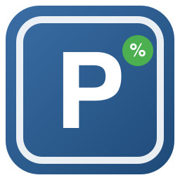

🇩🇪 [Deutsche Version](README.de.md)



# p-count Parking Occupancy for Home Assistant

Custom integration for Home Assistant that exposes parking occupancy data
from [p-count.de](https://p-count.de) as sensors – one "free spots" entity
per parking section.

Not officially affiliated with or endorsed by p-count.de. Use at your own
risk.

## Requirements

- A p-count.de parking instance with credentials (carpark ID, username,
  password) – get these from your parking operator, not from this
  integration.
- Home Assistant ≥ 2024.1.0

## Installation

### Via HACS (recommended, once listed in the store)

Until it's accepted into the official HACS store, add it as a custom
repository:

1. HACS → Integrations → Menu (⋮) → Custom repositories
2. URL: `https://github.com/HalmSascha/ha-pcount-integration`, category:
   Integration
3. Install "p-count Parking Occupancy" and restart Home Assistant

### Manual

Copy `custom_components/pcount` into your Home Assistant
`config/custom_components/` directory and restart Home Assistant.

## Setup

Settings → Devices & Services → Add Integration → search for "p-count
Parking Occupancy". The setup dialog asks for:

| Field | Description |
|---|---|
| Host | Domain of your p-count instance, defaults to `p-count.de` |
| Carpark ID | Carpark slug from your p-count URL (e.g. `musterfirma1`) |
| Username | Basic auth username for your instance |
| Password | Basic auth password for your instance |

Unless your parking operator tells you otherwise, the carpark ID and
username are identical.

These credentials stay entirely local in your Home Assistant configuration
and are never shared or bundled – this integration ships without any
preset credentials for a specific parking operator.

## Provided Entities

For each parking section reported by the API (e.g. `P1+2`, `P3`), a sensor
entity is created with the current free-spot count. Additional attributes:
`short_name`, `long_name`, `occupied_spots`, `measured_at`.

Sensor names follow your Home Assistant UI language (entity translations,
English and German included) instead of being hardcoded – e.g. "Free spots
P1+2" in English, "Freie Plätze P1+2" in German. The auto-assigned entity ID
is derived once at creation time and then stays stable, even if you later
change your language.

## Poll Interval

Defaults to 30 seconds. Changeable under Settings → Devices & Services →
p-count → Configure. The interval cannot be set below 30 seconds (lower
values are rejected in the form with an error message) – a safeguard against
accidentally overloading the API. Changes take effect immediately, no Home
Assistant restart required.

## Lovelace Card

The integration ships its own custom card (`pcount-card`), visually modeled
after the official p-count Mobile/WebApp: a header with the carpark name and
"last updated" timestamp, an optional company logo banner, and one row per
section with a red/green occupied-vs-free bar.

The card registers itself as a frontend resource automatically (no manual
entry needed under Settings → Dashboards → Resources).

### Visual Editor

When adding the card via the dashboard UI ("Add Card" → "p-count Parking
Occupancy"), a visual editor (built on `ha-form`) opens with an entity
picker for the sensors plus text fields for title and company logo URL – no
manual YAML needed. The YAML/UI code editor keeps working in parallel.

### YAML Example

```yaml
type: custom:pcount-card
title: Musterfirma 1
logo_url: https://example.com/logo.png
entities:
  - sensor.free_spots_p1_2   # replace with your actual entity IDs
  - sensor.free_spots_p3
```

Entity IDs are auto-generated at setup time from your device/carpark name
and the sensor's translated name, so the exact values depend on your
language and carpark ID – look them up under Settings → Devices & Services
→ p-count → your carpark → Entities.

| Option | Required | Description |
|---|---|---|
| `entities` | yes | List of free-spots sensor entity IDs, in display order |
| `title` | no | Card heading, defaults to "Parking Occupancy" |
| `logo_url` | no | URL of a company logo, shown as a banner below the header (mirrors the logo banner in the p-count app) |

Colors can be customized per dashboard/theme via CSS variables:
`--pcount-card-occupied-color`, `--pcount-card-free-color`,
`--pcount-card-label-color`.

## Logo / Brand Icon

Self-designed, license-free logo – not an official p-count.de trademark.
Ships inline at `custom_components/pcount/brand/` (icon.png, icon@2x.png,
logo.png, logo@2x.png) and is picked up automatically by Home Assistant's
[Brands Proxy API](https://github.com/home-assistant/brands) (HA ≥
2026.3.0) – no external submission or waiting on a PR needed, it just shows
up in Settings → Devices & Services after installing/updating. On older HA
cores the icon slot is simply blank; the integration still works.
`icon.png` at the repo root is the same image, used by HACS/GitHub for the
repository thumbnail.

## Roadmap

- [x] Foundation: config flow, coordinator, sensor entities
- [x] Lovelace card (`pcount-card`), modeled after the p-count app
- [x] Visual card editor (`getConfigElement`)
- [x] Bilingual README (DE/EN)
- [x] Localize sensor entity names (entity translations)
- [x] Logo / brand icon (self-designed, served via the Brands Proxy API)
- [ ] Tests (pytest-homeassistant-custom-component)
- [ ] Submission to the official HACS default store
- [ ] iOS app with CarPlay integration as a separate follow-up project

## License

[MIT](LICENSE)
